# Hello, I'm Ravi Teja 👋

**Java Full Stack Developer | Andhra Pradesh, India**

I'm mastering Java Full Stack by building 100 projects from basic to advanced. Each project = 1 concept mastered.

> 🚀 On a mission to build **100 Java Full Stack Projects** and master System Design!

### 🔥 Current Status
---

## 🏆 TIER 1: FOUNDATIONS - COMPLETED! ✅

**12/12 Projects Done | July 2026**

| # | Project | Concepts | Repo |
|---|---------|----------|------|
| 01 | **CLI Calculator** | OOP, Interface, Exception | [🔗](https://github.com/raviteja-dev950/01-cli-calculator) |
| 02 | **Student Management** | ArrayList, CRUD, Streams | [🔗](https://github.com/raviteja-dev950/02-student-management) |
| 03 | **To-Do CLI** | File Handling, Streams | [🔗](https://github.com/raviteja-dev950/03-todo-cli) |
| 04 | **Bank Account Sim** | Custom Exception, History | [🔗](https://github.com/raviteja-dev950/04-bank-account-sim) |
| 05 | **File Renamer Tool** | NIO, Bulk Rename | [🔗](https://github.com/raviteja-dev950/05-file-renamer-tool) |
| 06 | **JSON Parser Tool** | Jackson, Validation | [🔗](https://github.com/raviteja-dev950/06-json-parser-tool) |
| 07 | **CSV Reader/Writer** | OpenCSV, Filter | [🔗](https://github.com/raviteja-dev950/07-csv-reader-writer-tool) |
| 08 | **Notes App** | NIO, LocalDateTime | [🔗](https://github.com/raviteja-dev950/08-notes-app) |
| 09 | **Unit Converter** | Maps, OOP | [🔗](https://github.com/raviteja-dev950/09-unit-converter) |
| 10 | **Quiz App CLI** | Timer, Scoring | [🔗](https://github.com/raviteja-dev950/10-quiz-app) |
| 11 | **Student Grade Tracker** | Total, Avg, Grade Logic | [🔗](https://github.com/raviteja-dev950/11-student-grade-tracker) |
| 12 | **Contact Book** | CRUD, Iterator | [🔗](https://github.com/raviteja-dev950/12-contact-book) |

> ✨ **All repos have Clean Code, Great READMEs, Screenshots & Commit History!**

---

## 🗺️ My 100 Projects Roadmap

```mermaid
graph LR
    A[✅ Tier 1: Foundations<br/>12/12 Done]
    --> B[🔜 Tier 2: Java + SQL<br/>JDBC + MySQL]
    B --> C[ Tier 3: Web Basics<br/>Servlets + JSP]
    C --> D[ Tier 4: Spring Core]
    D --> E[ Tier 5: Spring Boot + REST]
    E --> F[ Tier 6: Frontend Mastery]
    F --> G[ Tier 7: Full Stack]
    G --> H[ Tier 8: Microservices]
    H --> I[ Tier 9: DevOps + Cloud]
    I --> J[ Tier 10: System Design]

```

### 📫 Reach Me
LinkedIn: [https://www.linkedin.com/in/vemulaleelavenkataraviteja/] | Email: [vemularaviteja06@gmail.com]

